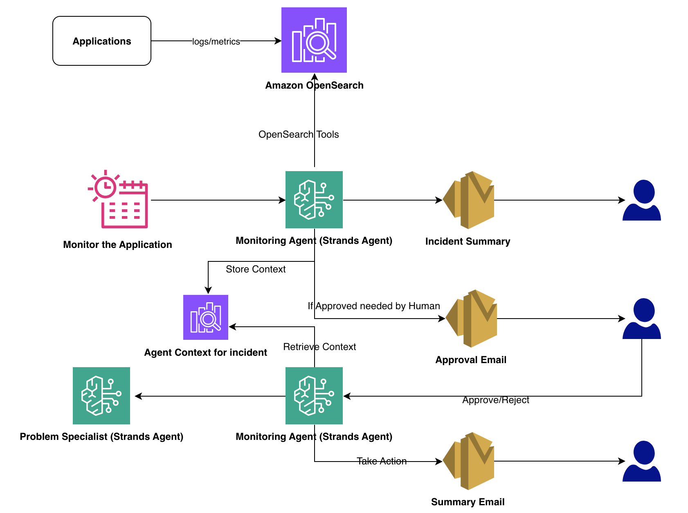
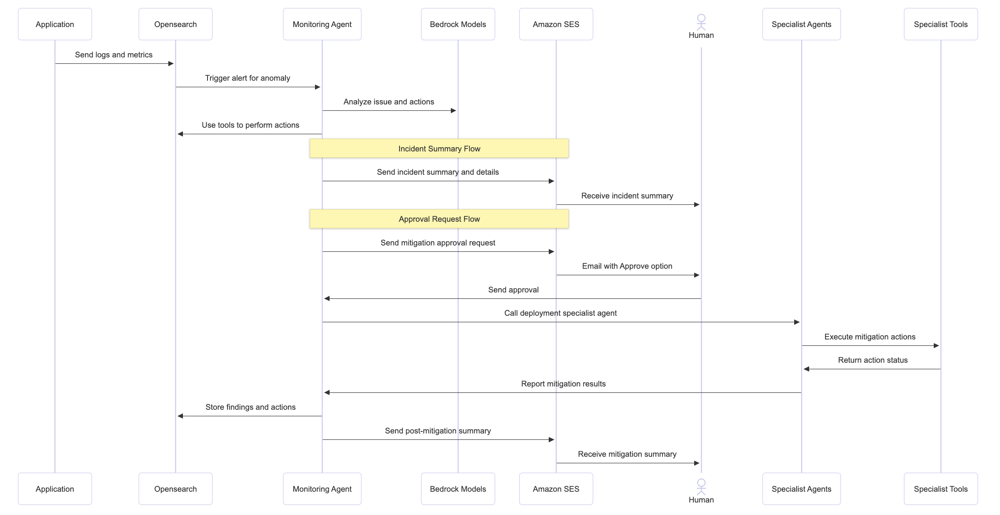

# OASIS - Operational AI System for Incident Solutions

> **Important Notice:**
> This is an experimental system designed for learning and demonstration purposes only. Implementation in a production environment requires:
> - Proper security controls and permissions
> - Complete risk assessment
> - Thorough testing
> - Compliance validation
> - Additional error handling
> - Custom tooling based on specific use cases
> - Appropriate approval workflows
> - Proper logging and monitoring
>
> ⚠️ **IMPORTANT SECURITY NOTICE**: This experimental prototype contains autonomous agents. For security reasons, only deploy and run in isolated sandbox environments with appropriate approvals. Never use in production systems or with access to sensitive resources. ⚠️

## Project Overview
OASIS demonstrates how AI agents can revolutionize IT operations by automating complex incident management workflows. Built using Amazon Bedrock and the Strands agent framework, it showcases autonomous agents handling real-world operational scenarios through advanced log and metric analysis. The system leverages OpenSearch for comprehensive monitoring, enabling agents to detect anomalies, correlate events across services, and provide data-driven incident resolution with minimal human intervention.

### Why This Prototype Matters
- Demonstrates end-to-end incident management automation
- Reduces manual intervention in routine operations
- Shows practical implementation of AI agents in production
- Provides measurable operational improvements

## Architecture 



### OpenSearch Integration

The agent monitor application integrates with OpenSearch to provide comprehensive monitoring capabilities:

1. **Log Monitoring**:
   - Continuously monitors the `app-logs-logs` index for error patterns
   - Analyzes log entries in real-time using optimized aggregation queries
   - Detects error spikes by comparing current rates against historical baselines
   - Identifies service-specific issues through error type classification
   - For POC purposes we used a scheduler to trigger agents, but it can be automated with OpenSearch anomaly detection to trigger agents based on incidents

2. **Metric Visualization**:
   - Tracks system and application metrics in the `app-logs-metrics` index
   - Visualizes metric trends to identify performance anomalies
   - Correlates metrics with log events for comprehensive incident analysis
   - Supports custom dashboards for real-time operational visibility

3. **Incident Management**:
   - Stores findings in dedicated `app-logs-agent-findings` index
   - Maintains complete incident lifecycle from detection through resolution
   - Enables human-in-the-loop approval workflow for critical actions
   - Provides historical incident data for trend analysis and reporting


## Data Flow



### 1. Incident Detection
- Application sends logs/metrics to OpenSearch
- Monitoring Agent detects anomaly through log/metric analysis
- Bedrock models analyze incident patterns and suggest actions
- Finding stored in OpenSearch with status "initial_detection"
- Unique incident ID generated for tracking

### 2. Initial Assessment & Communication
- Monitoring Agent prepares comprehensive incident summary
- Incident details stored in OpenSearch, status updated to "analysis_complete"
- Incident summary email sent to stakeholders via Amazon SES, including:
  - Incident ID
  - Detection time
  - Impact assessment
  - Proposed mitigation

### 3. Approval Process
- Monitoring Agent sends approval request via Amazon SES
- Email contains:
  - Approve link with incident ID
  - Proposed mitigation steps
  - Risk assessment
  - API Gateway endpoint reference
- Finding status updated to "pending_approval"

### 4. Mitigation Execution
- Upon approval, status updated to "approved"
- Deployment Specialist Agent triggered
- Agent executes approved actions using deployment tools
- Real-time status updates stored in OpenSearch
- Action execution logs maintained for audit

### 5. Resolution & Reporting
- Deployment Specialist Agent reports completion
- Finding status updated to "mitigated"
- Monitoring Agent generates resolution summary
- Final report sent via Amazon SES including:
  - Actions taken
  - Resolution time
  - System status
  - Next steps/recommendations

## Data Management
- OpenSearch maintains:
  - Complete incident timeline
  - All action logs
  - System state changes
  - Historical context
- Status transitions:
  1. initial_detection
  2. analysis_complete
  3. pending_approval
  4. approved
  5. mitigated

## System Integration
- API Gateway handles approval responses
- Amazon SES manages all email communications
- Bedrock models provide analysis support
- Deployment tools execute approved actions
- OpenSearch maintains state and history
- AWS Secrets Manager securely stores credentials and URLs
   
## Features
- Automated incident detection and analysis
- Real-time monitoring with OpenSearch integration
- Intelligent error correlation and root cause analysis
- Automated deployment verification and fixes
- Smart notification system with context-aware alerts
- Consistent UTC timezone handling across all components
- Secure credential management with AWS Secrets Manager

## Prototype Components

### 1. Automated Monitoring
- Real-time OpenSearch log analysis
- Metric anomaly detection
- Deployment change tracking
- Error pattern recognition

### 2. Smart Analysis
- Root cause identification
- Service dependency mapping
- Error correlation across services
- Performance impact assessment

### 3. Resolution Automation
- Automated deployment fixes
- Self-healing capabilities
- Guided resolution steps
- Incident documentation

## Business Impact Demonstration

### Time Efficiency
- Reduces incident resolution from hours to minutes
- Eliminates manual log analysis time
- Provides 24/7 automated monitoring

### Cost Benefits
- Reduces operational overhead
- Minimizes service disruptions
- Optimizes resource utilization

### Quality Improvements
- Consistent incident handling
- Reduced human error
- Comprehensive documentation
- Pattern-based learning

### Human Effort Reduction
- Eliminates manual log analysis and correlation
- Automates routine troubleshooting
- Handles basic deployment fixes
- Manages incident communications
- Generates status reports automatically

## Prerequisites
- AWS Account with appropriate permissions
- Python 3.9 or higher
- AWS CLI configured with credentials
- Amazon Bedrock access with permissions for Claude and Nova models
- Either:
  - An existing OpenSearch domain, or
  - Permissions to create a new OpenSearch domain
- AWS Secrets Manager access (recommended for production)
- Amazon SES with verified email addresses for sending notifications

## Installation

1. Clone the repository:
```bash
git clone https://github.com/aws-samples/sample-operational-ai-agent-1.git
cd sample-operational-ai-agent-1
```

2. Install dependencies:
```bash
pip install -r requirements.txt
```

## Setup and Deployment

### 1. One-Step Setup (Recommended)

Use the combined setup script to create all required resources:

```bash
./scripts/setup_oasis.sh --region <your-region>
```

This script will:
- Create an OpenSearch domain with secure settings
- Set up required indices for logs, metrics, and agent findings
- Create an API Gateway for the approval workflow
- Store all configuration in AWS Secrets Manager
- Prompt for email settings (sender and recipient)

Additional options:
- `--domain-name`: Name of the OpenSearch domain (default: oasis-domain)
- `--instance-type`: OpenSearch instance type (default: t3.small.search)
- `--instance-count`: Number of instances (default: 1)
- `--volume-size`: EBS volume size in GB (default: 10)
- `--model-id`: Bedrock model ID (default: anthropic.claude-3-5-sonnet-20240620-v1:0)

### 2. Deploy the Smart Assistant Lambda Function

After setting up the OpenSearch domain and storing configuration in Secrets Manager:

```bash
./scripts/deployment/deploy_smart_assistant.sh --region <your-region>
```

This script will:
- Create a Lambda deployment package with all required dependencies
- Set up IAM roles and policies for the Lambda function
- Create a Lambda layer for the Strands agent framework
- Deploy the Smart Assistant Lambda function
- Configure CloudWatch Events to trigger the Lambda function
- Set up API Gateway integration for the approval workflow

## Testing and Simulation

### 1. Local Testing

To test the Smart Assistant agent locally:

```bash
# Set required environment variables
export OASIS_SECRET_NAME=oasis-configuration
export OASIS_SECRET_REGION=<your-region>

# Run the local test script
python agents/test_lambda_locally.py
```

This will:
- Load configuration from AWS Secrets Manager
- Run the Smart Assistant agent with a test event
- Process any incidents and generate findings
- Test the approval workflow with the generated finding ID

You can modify the test script to test different scenarios by editing the event parameters.

### 2. AWS Lambda Testing

After deploying to AWS Lambda, you can test the function:

1. **Using the AWS Console:**
   - Navigate to the Lambda function in the AWS Console
   - Create a test event with the following JSON:
     ```json
     {
       "check_interval": 30
     }
     ```
   - Click "Test" to run the function

2. **Using AWS CLI:**
   ```bash
   aws lambda invoke --function-name oasis \
     --payload '{"check_interval": 30}' \
     --region <your-region> \
     output.json
   ```

### 3. Simulate Incidents

To generate test data for the system:

```bash
# Run a single incident simulation
python scripts/simulation/simulate_incident.py

# Run continuous simulation with various incident types
python scripts/simulation/simulator.py
```

The simulator will:
- Generate realistic logs and metrics in OpenSearch
- Create periodic incidents of varying severity
- Simulate different failure scenarios (deployments, resource exhaustion, etc.)
- Provide data for the agent to analyze

### 4. End-to-End Testing

To test the complete workflow:

1. Run the simulator to generate incident data
2. Wait for the Lambda function to detect incidents (either triggered manually or via CloudWatch Events)
3. Check your email for incident notifications and approval requests
4. Click the approval link to test the approval workflow
5. Verify that the incident status is updated in OpenSearch

### 5. View Results

After running tests:
- Check the OpenSearch dashboard for agent findings
- Look for emails sent by the agent with incident summaries
- Review the approval workflow emails with action links
- Monitor CloudWatch Logs for the Lambda function execution details

## Cleanup

### 1. Remove All Resources

To remove all resources created by the setup script:

```bash
./scripts/cleanup_oasis.sh --region <your-region>
```

This will delete:
- The OpenSearch domain
- AWS Secrets Manager secrets
- API Gateway resources
- Lambda function and related resources

### 2. Clean Up Lambda Resources Only

If you want to remove only the Lambda function and related resources while keeping OpenSearch:

```bash
./scripts/deployment/cleanup_smart_assistant.sh --region <your-region>
```

This will delete:
- The Lambda function
- IAM roles and policies
- CloudWatch Events rule
- Lambda layers
- API Gateway integrations

## Architecture Components
- **Smart Assistant**: Main Lambda function monitoring OpenSearch logs
- **API Gateway**: REST API endpoint for approval/rejection actions
- **Deployment Specialist**: Handles deployment-related incidents
- **Agent Tools**: Collection of specialized analysis tools
- **OpenSearch Integration**: Real-time log and metric monitoring
- **AWS Secrets Manager**: Securely stores credentials and URLs

## Timezone Handling
All timestamps in the system are standardized to UTC to ensure consistent time representation across components:
- Log entries use UTC timestamps
- Metrics data uses UTC timestamps
- All datetime operations use the UTC timezone
- ISO 8601 format is used for timestamp serialization

## Contributing
See [CONTRIBUTING](CONTRIBUTING.md#security-issue-notifications) for more information.

## License
This library is licensed under the MIT-0 License. See the LICENSE file.

## Support
For questions or issues, please open a GitHub issue.